# Accident Detection & Automated SOS Alert

> **An edge-first accident detection and emergency-response platform that detects potential accidents locally, confirms them using backend ML, provides a human cancellation window, supports manual SOS, communicates through independent channels, and routes confirmed incidents toward appropriate responders.**

**Problem Statement:** I-NXS-002 Accident Detection & Automated SOS Alert  
**Team ID & Name:** INX-`039` - `π(Pi)`  
**Domain:** IoT & Smart Mobility  

### 🛠️ Tech Stack
- **IoT & Hardware:** ESP8266 (NodeMCU), MPU6050 (IMU), SIM900A (GSM), Temperature/Humidity Sensor, Vibration Sensor, C++ (Arduino)
- **Backend & API:** Python, FastAPI, SQLAlchemy, SQLite, Uvicorn
- **Machine Learning:** Scikit-Learn (Accident classification pipeline)
- **Frontend Dashboard:** React 19, TypeScript, Vite, Tailwind CSS v4, Framer Motion, Leaflet (Maps)

---

## Table of Contents (Click to navigate)

- **1. Product & Architecture**
  - [1. Executive Summary](#1-executive-summary)
  - [2. Problem Statement](#2-problem-statement)
  - [3. What We Built](#3-what-we-built)
  - [4. System Modules](#4-system-modules)
  - [5. Module Interaction Map](#5-module-interaction-map)
  - [6. Complete System Architecture](#6-complete-system-architecture)
  - [7. End-to-End Accident Flow](#7-end-to-end-accident-flow)

- **2. Vehicle & Edge Intelligence**
  - [8. Hardware & Sensor Acquisition](#8-module-1--hardware--sensor-acquisition)
  - [9. Edge Screening & Temporal Processing](#9-module-2--edge-screening--temporal-processing)
  - [10. Feature Extraction](#10-module-3--feature-extraction)
  - [11. Accident ML & Sensor Fusion](#11-module-4--accident-ml--sensor-fusion)
  - [12. Adaptive / Reinforcement Learning Layer](#12-module-5--adaptive--reinforcement-learning-layer)
  - [13. SOS & Human Override](#13-module-6--sos--human-override)
  - [19. Locked Device Data Contract](#19-locked-device-data-contract)
  - [20. Accident Confirmation Logic](#20-accident-confirmation-logic)

- **3. Communication & Connectivity**
  - [14. Communication Layer](#14-module-7--communication-layer)
  - [21. Communication Decision Logic](#21-communication-decision-logic)
  - [23. Failure & Degraded Modes](#23-failure--degraded-modes)
  - [18. Local Device Provisioning](#18-module-11--local-device-provisioning)

- **4. Backend & Emergency Response**
  - [15. Backend & Incident Management](#15-module-8--backend--incident-management)
  - [16. Responder Orchestration](#16-module-9--responder-orchestration)
  - [22. Nearest Responder Logic](#22-nearest-responder-logic)
  - [24. Reliability & Idempotency](#24-reliability--idempotency)
  - [25. API Surface](#25-api-surface)

- **5. Responder Operations**
  - [17. Responder Dashboard](#17-module-10--responder-dashboard)
  - [26. Current Prototype State](#26-current-prototype-state)
  - [30. Demo Scenarios](#30-demo-scenarios)

- **6. Engineering, Validation & Security**
  - [27. Repository Structure](#27-repository-structure)
  - [28. Setup & Run](#28-setup--run)
  - [29. Testing & Validation](#29-testing--validation)
  - [31. Security & Privacy](#31-security--privacy)
  - [32. Known Limitations](#32-known-limitations)
  - [33. Production Evolution & ERSS-112 Alignment](#33-production-evolution--erss-112-alignment)
  - [34. Final Engineering Position](#34-final-engineering-position)
---

# 1. Executive Summary

The system turns an accident from a raw sensor event into an **actionable emergency incident**.

The core idea is:

```text
SENSE
  ↓
SCREEN LOCALLY
  ↓
ANALYZE THE EVENT
  ↓
CONFIRM WITH ML
  ↓
ALLOW HUMAN OVERRIDE
  ↓
TRIGGER SOS
  ↓
COMMUNICATE
  ↓
CREATE INCIDENT
  ↓
SELECT APPROPRIATE RESPONSE
  ↓
TRACK RESPONSE
```

The system is deliberately split into modules so that a failure in one layer does not automatically invalidate the others.

For example:

```text
Backend unavailable
      ≠
Accident detection unavailable

Internet unavailable
      ≠
SIM SMS/call unavailable

GPS unavailable
      ≠
Accident detection unavailable
```

The prototype therefore does not treat "network status" as one boolean.

---

# 2. Problem Statement

A simplistic accident detector looks like:

```text
Sensor
  ↓
Internet
  ↓
Cloud
  ↓
Accident decision
  ↓
Alert
```

That creates two problems.

### Problem A — Accident decisions depend on connectivity

If the backend is unavailable, the device should not become blind.

### Problem B — A single sensor threshold creates false alarms

A pothole, hard brake, aggressive turn or controlled vehicle bump can produce a large acceleration spike.

Therefore the project separates:

```text
Fast local screening
        +
Temporal feature extraction
        +
ML confirmation
        +
Human cancellation
```

The second problem is what the multi-sensor pipeline addresses.

---

# 3. What We Built

<div align="center">
  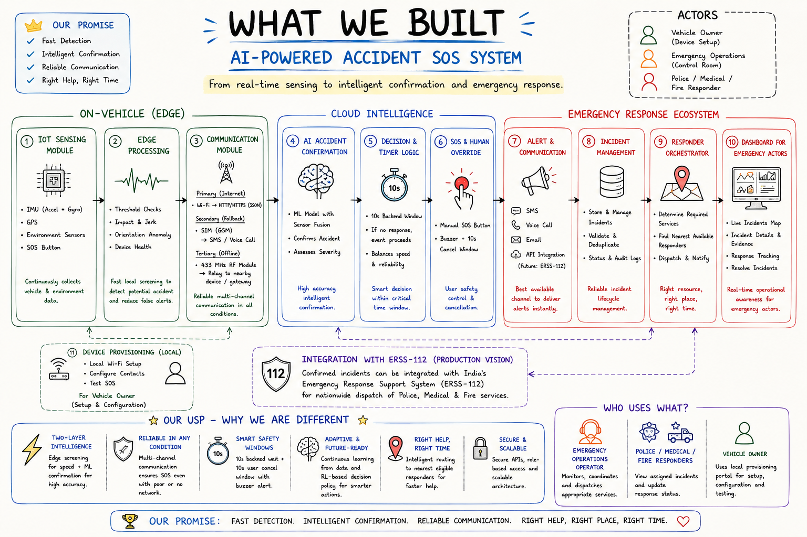
</div>

The project combines:

- ESP8266 edge controller
- MPU6050 accelerometer and gyroscope
- GPS input
- SIM900A cellular modem
- SOS/manual button input
- cancellation button input
- buzzer
- temperature/humidity sensing
- vibration sensing
- local filtering
- rolling buffer
- event-window analysis
- accident features
- sensor fusion
- backend ML accident classification
- fail-safe SOS timing
- direct cellular SMS/call path
- backend incident management
- responder discovery and ranking architecture
- responder operations dashboard
- local ESP8266 provisioning architecture
- adaptive-learning architecture for future improvement

The actual solution is the complete detection-to-response chain.

---

# 4. System Modules

The solution is organized into **11 major modules**.

| # | Module | Purpose |
|---|---|---|
| 1 | Hardware & Sensor Acquisition | Collect physical measurements |
| 2 | Edge Screening & Temporal Processing | Perform fast local checks and maintain event context |
| 3 | Feature Extraction | Convert raw samples into accident-relevant features |
| 4 | Accident ML & Sensor Fusion | Decide whether the event is an actual accident |
| 5 | Adaptive / RL Layer | Improve policy/model behavior from accumulated evidence |
| 6 | SOS & Human Override | Manage automatic/manual SOS and cancellation windows |
| 7 | Communication Layer | Move emergency information through available bearers |
| 8 | Backend & Incident Management | Persist, correlate and manage incidents |
| 9 | Responder Orchestration | Decide which response resources are appropriate |
| 10 | Responder Dashboard | Let operators monitor and act |
| 11 | Local Device Provisioning | Configure the installed device without Internet |

---

# 5. Module Interaction Map

The system is architected primarily as a **fully autonomous, zero-touch accident detection and dispatch pipeline**, supplemented by a **human override and manual distress mechanism**:

- **Autonomous Detection & Escalation (Default Flow):**
  1. Sensors continuously acquire data at 50 Hz without human intervention.
  2. The ESP8266 automatically screens for abnormal G-force and rotational spikes in a rolling buffer.
  3. Validated triggers automatically extract temporal features and dispatch a locked telemetry packet to the backend.
  4. Backend ML confirms the accident, classifies severity, and automatically initiates the emergency escalation sequence.
  5. If the occupant is unconscious or incapacitated, the 10-second countdown expires and automatically triggers multi-channel emergency dispatch.

- **Human Override & Manual Entry:**
  - **Manual SOS:** Occupants can manually press the SOS button to request immediate aid (e.g., medical distress, engine fire) even if no impact occurred.
  - **Cancellation Window:** If a bump was minor or non-threatening, the occupant can press Cancel during the 10-second buzzer countdown to prevent false dispatches.

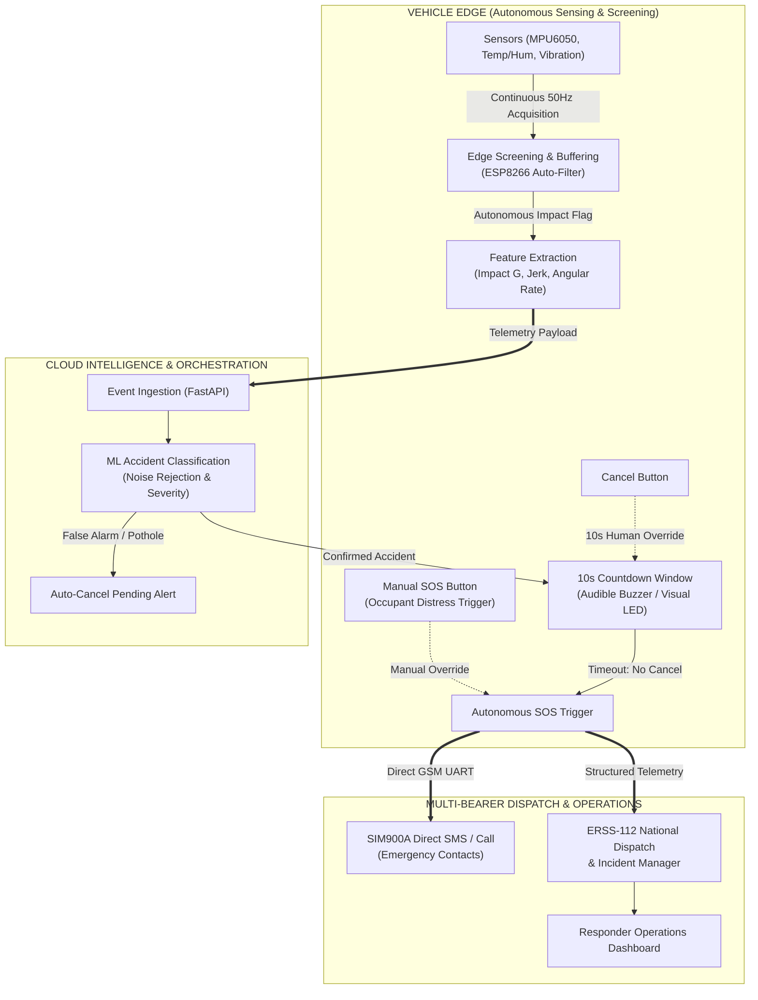

---

# 6. Complete System Architecture

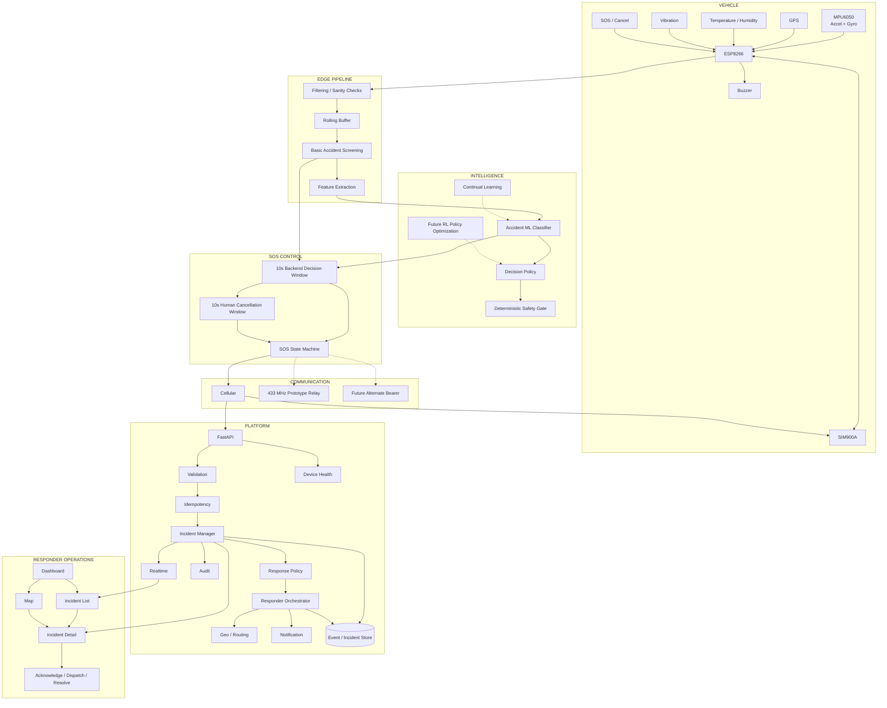

---

# 7. End-to-End Accident Flow

The exact agreed flow is:

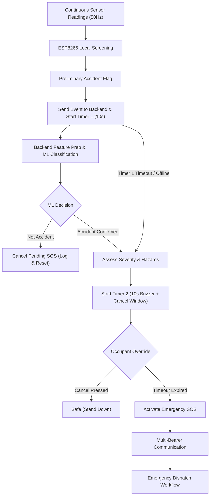

### Timer 1

Purpose:

> Give the backend and ML classifier an opportunity to confirm or reject the preliminary event.

### Timer 2

Purpose:

> Give the occupant a final opportunity to cancel the emergency escalation.

These two timers are deliberately different.

---

# 8. Module 1 — Hardware & Sensor Acquisition

## Responsibilities

The hardware module provides:

```text
MPU6050
├── accel_x
├── accel_y
├── accel_z
├── gyro_x
├── gyro_y
└── gyro_z

GPS
├── latitude
├── longitude
├── speed
└── fix state

Environment
├── temperature
└── humidity

Vibration
└── vibration state/context

Buttons
├── SOS
└── Cancel
```

The ESP8266 is the central controller.

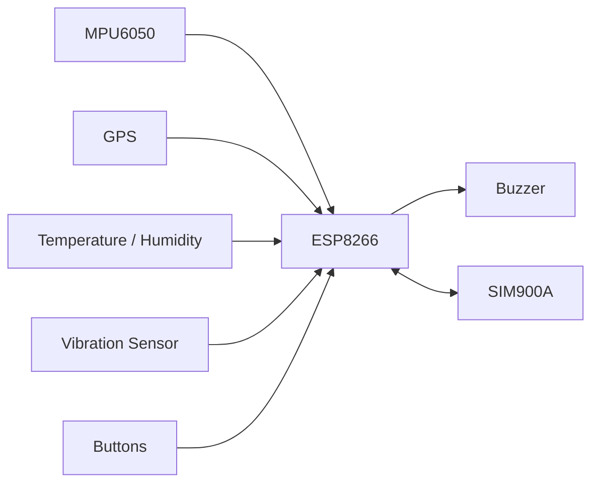

---

# 9. Module 2 — Edge Screening & Temporal Processing

The ESP does not wait for the backend to tell it whether every sample is interesting.

It performs fast local checks.

```text
Raw measurements
       ↓
Filtering / sanity checks
       ↓
Rolling buffer
       ↓
Basic accident screening
       ↓
Preliminary accident flag
```

The goal is:

> **Detect a potentially important event quickly and forward the relevant context.**

The goal is not to replace the backend ML decision.

## Rolling buffer

Current prototype design:

```text
50 Hz
100 samples
≈ 2 seconds of recent history
```

```text
oldest                                      newest
  ↓                                            ↓
┌─────────────────────────────────────────────────┐
│ t-2.0 ... t-1.5 ... t-1.0 ... t-0.5 ... t0    │
└─────────────────────────────────────────────────┘
```

This lets us observe:

```text
before → impact → after
```

instead of only one sample.

---

# 10. Module 3 — Feature Extraction

Features are extracted from the event window.

## Acceleration magnitude

```text
A = sqrt(accel_x² + accel_y² + accel_z²)
```

## `impact_g`

Acceleration magnitude relative to the 1 g baseline.

## `peak_acceleration`

Maximum acceleration magnitude across the event window.

## `peak_jerk`

```text
jerk = |Δacceleration| / Δt
```

## `peak_angular_velocity`

```text
ω = sqrt(gyro_x² + gyro_y² + gyro_z²)
```

## `gyro_delta`

Change in rotational activity relative to the pre-event baseline.

## `velocity_change`

Where valid GPS speed history exists:

```text
|speed_before - speed_after|
```

## `orientation_change`

Estimate change in gravity-relative orientation over the event window.

## `post_impact_motion`

Characterize movement immediately after the event.

Together:

```text
impact
+ jerk
+ rotation
+ velocity
+ orientation
+ post-impact motion
```

provide a much richer accident signature than a single impact threshold.

---

# 11. Module 4 — Accident ML & Sensor Fusion

The system uses a two-stage intelligence model.

```text
ESP:
fast preliminary screening

Backend:
final ML classification
```

## Classification

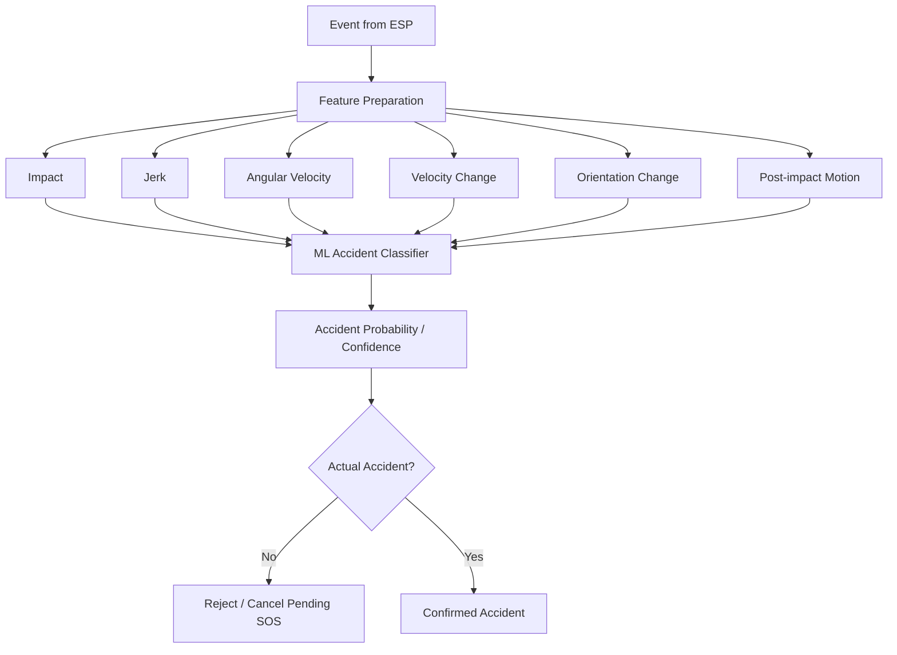

### The key distinction

```text
basic_accident_flag
        ≠
final accident decision
```

The ESP flag says:

> "The local readings look abnormal enough to investigate."

The ML decision says:

> "The available evidence indicates an actual accident."

---

# 12. Module 5 — Adaptive / Reinforcement Learning Layer

This is where the continuous sensor stream becomes useful beyond the initial model.

## Important terminology

Continuous incoming data by itself is **not reinforcement learning**.

The architecture combines:

```text
Supervised accident classifier
+
Continual / adaptive learning
+
Potential RL decision-policy optimization
```

### Accident classifier

Answers:

```text
How likely is this to be an accident?
```

### Continual learning

Answers:

```text
Has the real-world operating distribution changed?
Can the validated model improve using newly accumulated evidence?
```

### Reinforcement learning

Can eventually answer:

```text
Given the current context, what response/decision policy minimizes
false alarms while protecting against missed serious accidents?
```

---

## Learning loop

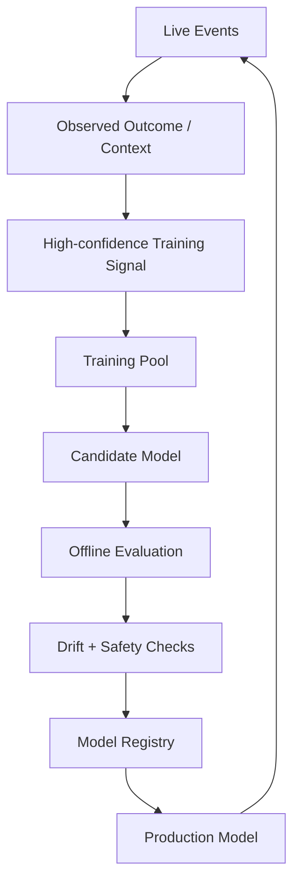

### No mandatory human labeling

The system does not need an operator to label every event.

Potential learning signals include:

```text
controlled RC experiments
future post-impact sensor behaviour
multi-sensor agreement
repeated trajectory evidence
high-confidence pseudo-labels
operational outcomes
```

Human feedback can remain an optional higher-quality source, not a mandatory dependency.

---

## Where RL belongs

Do **not** replace the accident classifier with a pure RL agent.

A safer architecture is:

```text
Features
  ↓
Accident classifier
  ↓
Probability
  ↓
Decision policy
  ├── deterministic policy
  └── future RL policy optimization
  ↓
Safety gate
  ↓
Action
```

The RL layer may eventually optimize decisions such as:

```text
continue observation
request more evidence
escalate
choose escalation timing
choose communication strategy
```

rather than directly experimenting with life-safety decisions.

---

## Why the safety gate is mandatory

An adaptive model must never be allowed to freely experiment with emergency suppression.

```text
ML / RL proposal
       ↓
Safety constraints
       ↓
Allowed?
 ┌─────┴─────┐
YES          NO
 ↓            ↓
action      constrained action
```

The deterministic safety layer remains the final guardrail.

---

## Avoiding self-reinforcing errors

Do NOT do:

```text
model prediction
   ↓
assume prediction is true
   ↓
train immediately
   ↓
repeat
```

That can reinforce false classifications.

Instead:

```text
prediction
   ↓
outcome evidence
   ↓
confidence gate
   ↓
training pool
   ↓
candidate model
   ↓
offline evaluation
   ↓
safe deployment
```

Maintain a representative historical dataset to avoid catastrophic forgetting.

---

# 13. Module 6 — SOS & Human Override

The SOS layer has two independent entry points.

## Automatic

```text
ESP preliminary event
   ↓
backend ML confirms accident
   ↓
10-second human cancellation window
   ↓
SOS
```

## Manual

```text
User senses danger
OR
user remains conscious after an accident
   ↓
SOS button
   ↓
10-second human cancellation window
   ↓
SOS
```

Manual SOS is therefore useful even if the automatic classifier never fires.

---

## State machine

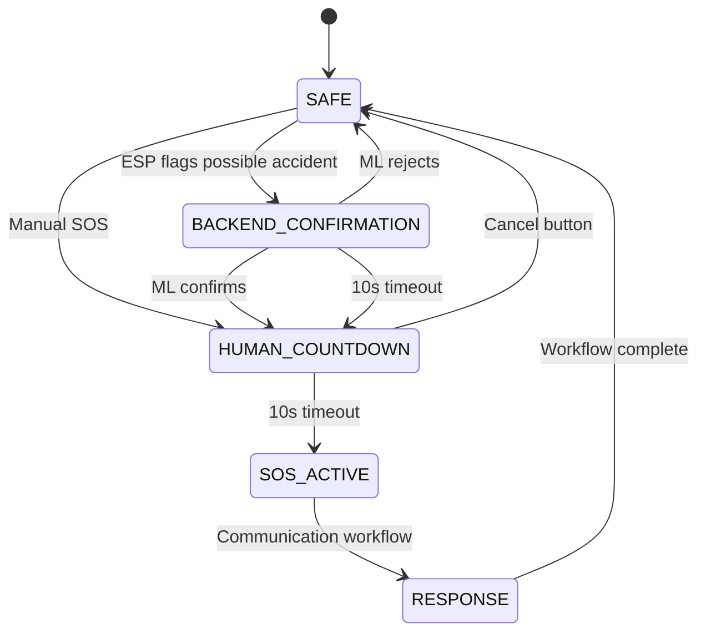

The physical buzzer provides local feedback during the human cancellation phase.

---

# 14. Module 7 — Communication Layer

Communication is independent of accident classification.

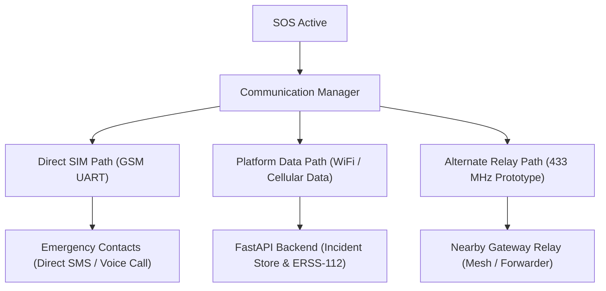

## Direct emergency path

```text
ESP8266
   ↓ UART
SIM900A
   ↓
Cellular network
   ├── SMS
   └── Voice call
```

This can work without a FastAPI round trip when cellular service exists.

## Platform path

```text
Device
   ↓
available data path
   ↓
FastAPI
   ↓
incident management
```

## Alternate RF prototype

```text
ESP8266
   ↓
433 MHz transmitter
   ↓
433 MHz receiver / relay
   ↓
connected gateway
   ↓
backend
```

This is a prototype relay concept, not a claim of universal connectivity.

---

# 15. Module 8 — Backend & Incident Management

FastAPI is the platform/control-plane layer.

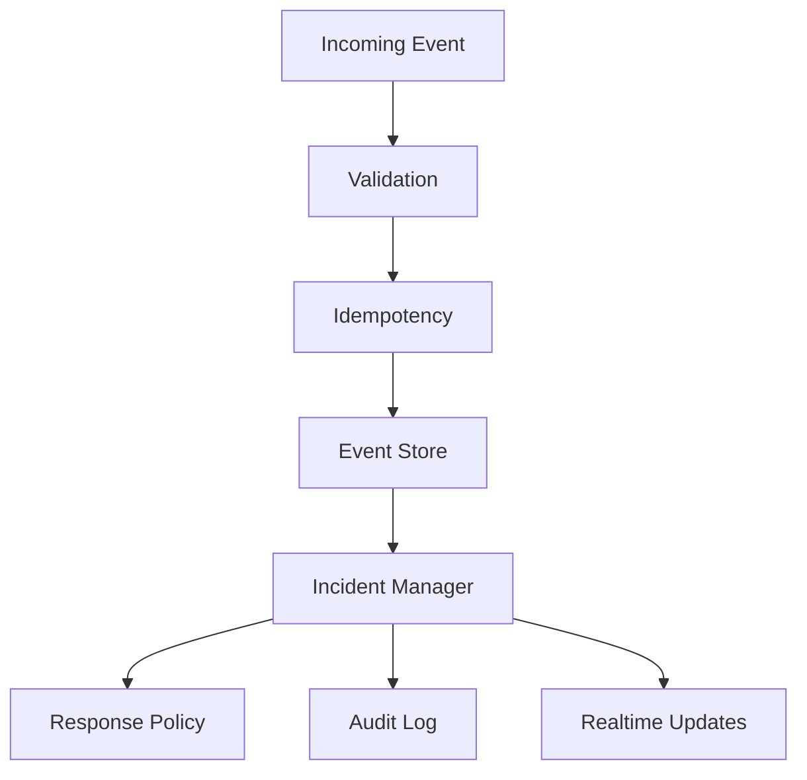

The backend is responsible for:

```text
event ingestion
validation
idempotency
incident creation
incident lifecycle
response policy
responder orchestration
response tracking
device health
dashboard APIs
```

It is not the only emergency communication path.

---

# 16. Module 9 — Responder Orchestration

After final accident confirmation:

```text
Accident
   ↓
Severity / available evidence
   ↓
Hazard assessment
   ↓
Required services
   ↓
Responder discovery
   ↓
Availability filter
   ↓
Distance / ranking
   ↓
Selection
   ↓
Notification
   ↓
Tracking
```

## Response policy

Example:

```text
LOW
→ log + dashboard

MODERATE
→ dashboard + configured contacts

SEVERE
→ Medical + Police

SEVERE + supported fire hazard
→ Medical + Police + Fire
```

These are prototype policy defaults, not government dispatch rules. In production, this layer formats and delivers structured incident payloads to national dispatch systems such as India's **ERSS-112** (see [Section 33](#33-production-evolution--erss-112-alignment)).

---

# 17. Module 10 — Responder Dashboard

The dashboard is for **operators/responders**, not the vehicle owner.

Its job is:

```text
MONITOR
 ↓
INVESTIGATE
 ↓
PRIORITIZE
 ↓
ACKNOWLEDGE
 ↓
DISPATCH
 ↓
RESOLVE
```

## Main views

```text
Overview
├── Active incidents
├── Severity summary
├── Fleet health
└── Map

Incidents
├── Active
├── Acknowledged
├── Dispatched
├── Resolved
└── Incident detail

Devices
├── Online
├── Unreachable
└── Device state

Events
└── Recent event stream
```

## Incident detail

```text
┌────────────────────────────────────────────────────────┐
│ [CRITICAL] SEVERE ACCIDENT                             │
├────────────────────────────────────────────────────────┤
│ Vehicle: VEHICLE-001                                  │
│ Incident: INC-0042                                   │
│                                                        │
│ [                 INCIDENT MAP                    ]   │
│                                                        │
│ Accident confidence: 94%                              │
│ Severity: SEVERE                                      │
│                                                        │
│ Impact: 5.8 G                                         │
│ Peak acceleration: ...                                │
│ Peak jerk: ...                                        │
│ Angular velocity: ...                                 │
│ Velocity change: ...                                  │
│                                                        │
│ GPS: ✓ Fixed                                          │
│ Speed: 42 km/h                                       │
│                                                        │
│ Medical: ✓ Delivered                                  │
│ Police: ✓ Delivered                                   │
│ Fire: — Not required                                  │
│                                                        │
│ [ ACKNOWLEDGE ] [ DISPATCH ] [ RESOLVE ]             │
└────────────────────────────────────────────────────────┘
```

The dashboard should receive responder distances and notification states from the backend rather than calculating them itself.

---

# 18. Module 11 — Local Device Provisioning

Installation should not require Internet.

The ESP8266 can enter setup mode and create its own local Wi-Fi network.

```text
ESP8266
   ↓
ACCIDENT-SOS-XXXX
   ↓
Owner's phone
   ↓
Browser
   ↓
http://192.168.4.1
```

The owner can configure:

```text
Vehicle name
Emergency contact 1
Emergency contact 2
Emergency contact 3
```

Then:

```text
Hardware diagnostics
   ↓
Test SOS
   ↓
Save configuration
   ↓
Complete setup
```

Configuration is persisted locally.

This Wi-Fi connection is only for provisioning:

```text
Phone ↔ ESP8266
```

It is not the emergency communication network.

---

# 19. Locked Device Data Contract

**This contract is final and frozen.**

The device output is exactly:

| # | Field | Type |
|---|---|---|
| 1 | `accel_x` | float |
| 2 | `accel_y` | float |
| 3 | `accel_z` | float |
| 4 | `gyro_x` | float |
| 5 | `gyro_y` | float |
| 6 | `gyro_z` | float |
| 7 | `impact_g` | float |
| 8 | `gps_lat` | float |
| 9 | `gps_lon` | float |
| 10 | `gps_speed_kmph` | float |
| 11 | `gps_fix` | bool |
| 12 | `timestamp` | millis since boot |
| 13 | `battery_pct` | numeric |
| 14 | `button_pressed` | bool |

### Contract rule

No module should silently:

```text
add mandatory fields
remove fields
rename fields
change units
change semantics
```

The backend and ML layers must work around this contract.

Derived features are not replacements for this contract.

---

# 20. Accident Confirmation Logic

This is the most important control sequence in the project.

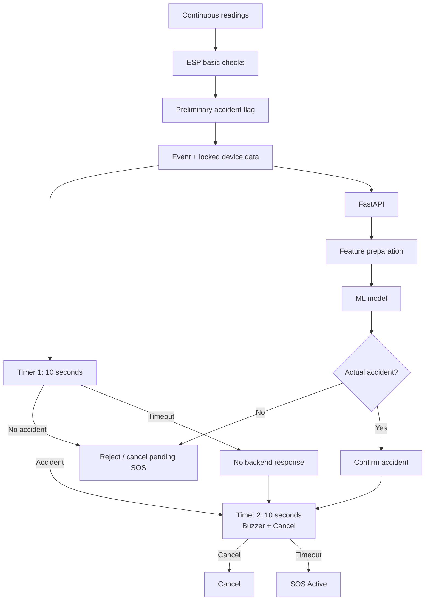

### Why this is valuable

It creates three protections:

```text
Protection 1:
local preliminary screening

Protection 2:
ML confirmation

Protection 3:
human cancellation
```

And if Protection 2 fails because the backend never responds:

```text
fail-safe local escalation
```

rather than silent suppression.

---

# 21. Communication Decision Logic

The system separates:

```text
Emergency communication
```

from:

```text
Platform communication
```

### Example

```text
Backend unavailable
+
Cellular available

Result:

Direct SMS/Call → still possible
Backend incident → delayed/unavailable
```

Another case:

```text
Cellular unavailable
+
433 MHz relay available

Result:

Alternate relay path may carry event
```

Another:

```text
No cellular
+
No relay
+
No alternate bearer

Result:

Detection continues
Event can be retained
Remote delivery cannot be claimed
```

---

# 22. Nearest Responder Logic

The backend does not simply search for the word:

```text
hospital
police station
fire station
```

It first determines:

```text
Which service is required?
```

Then:

```text
Which registered resources can provide it?
```

Then:

```text
Which are available?
```

Then:

```text
Which is geographically closest?
```

### Hackathon implementation

Use a controlled responder registry:

```text
responder_id
name
service_type
resource_type
latitude
longitude
availability
contact / endpoint
notification_method
```

Then:

```text
Required service
      ↓
Candidate responders
      ↓
Availability filter
      ↓
Search radius
      ↓
Haversine distance
      ↓
Ranking
      ↓
Selected responder
```

### Important distinction

```text
Hospital ≠ Ambulance
Police station ≠ available police unit
Fire station ≠ available fire engine
```

For production, this mock registry is replaced by an authorized integration with India's **Emergency Response Support System (ERSS-112)** under the Ministry of Home Affairs (MHA), which handles live GIS-based dispatch and CAD tracking of field units (see [Section 33](#33-production-evolution--erss-112-alignment)).

---

# 23. Failure & Degraded Modes

| Failure | Behaviour |
|---|---|
| GPS has no fix | Detection continues; no fake routing |
| Backend unavailable | Direct SIM path can remain available if cellular works |
| Cellular unavailable | SIM cannot transmit through the missing network |
| Device unreachable | Health state only; not treated as an accident |
| Duplicate event | Existing incident returned/linked |
| No responder | Incident remains active; response marked unavailable |
| One notification fails | Other response channels continue independently |
| False automatic trigger | Human cancellation can stop escalation |
| Occupant can identify danger | Manual SOS can bypass accident classification |
| No communication path | Detect + retain locally; do not claim remote delivery |

---

# 24. Reliability & Idempotency

A communication retry must not become a duplicate incident.

```text
Event A
 ↓
POST
 ↓
timeout
 ↓
retry
 ↓
same event
```

Expected:

```text
ONE INCIDENT
```

not:

```text
INCIDENT 1
INCIDENT 2
```

Keep these identities conceptually separate:

```text
Device event
      ↓
Backend incident
      ↓
Response records
```

Also keep separate:

```text
incident status
communication status
notification status
device health
```

---

# 25. API Surface

## Existing APIs

```http
GET  /api/health

POST /api/heartbeat
POST /api/impact

GET  /api/devices
GET  /api/events

POST /api/devices/{device_id}/acknowledge

POST /api/sensor
GET  /api/sensor
```

## Incident APIs

```http
GET  /api/incidents
GET  /api/incidents/{incident_id}

POST /api/incidents/{incident_id}/acknowledge
POST /api/incidents/{incident_id}/dispatch
POST /api/incidents/{incident_id}/resolve
POST /api/incidents/{incident_id}/cancel
```

## Responder APIs

```http
GET   /api/responders
GET   /api/responders/{responder_id}

POST  /api/responders
PATCH /api/responders/{responder_id}
DELETE /api/responders/{responder_id}

GET /api/responders/nearby
```

The existing device contract remains the source of truth for the device layer.

---

# 26. Current Prototype State

## Present in the current firmware

- ESP8266 controller
- MPU6050 acquisition
- 50 Hz sampling
- approximately 2-second rolling/ring buffer
- `impact_g`
- peak acceleration
- jerk
- peak angular velocity
- velocity-change estimate
- orientation-change estimate
- post-impact motion
- weighted accident score
- severity classification
- 10-second pending logic
- manual SOS
- cancellation
- buzzer
- event identifiers
- local event queue/retry logic
- SIM900A SMS
- SIM900A voice calls
- backend data submission
- temperature/humidity support

## Current caveats

The supplied prototype firmware currently uses fallback GPS values because the GPS hardware is not yet connected in that implementation, and battery percentage is stubbed.

The full two-stage backend ML confirmation and responder-orchestration architecture is the target system design and must be represented accurately in implementation.

---

# 27. Repository Structure


```text
accident-sos/
│
├── client/
│   ├── public/
│   ├── src/
│   │   ├── assets/
│   │   ├── components/
│   │   ├── context/
│   │   ├── lib/
│   │   ├── services/
│   │   ├── App.css
│   │   ├── App.tsx
│   │   ├── index.css
│   │   └── main.tsx
│   ├── package.json
│   ├── tsconfig.json
│   └── vite.config.ts
├── IoT/
│   └── Smart_Vehicle_SOS_ESP8266_SIM900A/
│       ├── tests/
│       ├── config.cpp
│       ├── config.h
│       ├── provisioning.cpp
│       ├── provisioning.h
│       └── Smart_Vehicle_SOS_ESP8266_SIM900A.ino
│
├── ml/
│   ├── accident_classifier.pkl
│   └── accident_pipeline.pkl
│
├── server/
│   ├── app/
│   │   ├── api/
│   │   ├── core/
│   │   ├── db/
│   │   ├── models/
│   │   ├── services/
│   │   └── main.py
│   ├── tests/
│   ├── requirements.txt
│
└── README.md
```

---

# 28. Setup & Run

## Firmware & Device Provisioning

The firmware utilizes a one-time configuration via a Wi-Fi captive portal to securely store network credentials and emergency contacts in EEPROM.

1. **Install Dependencies**: In the Arduino IDE, install ESP8266 board support and required libraries (including `ArduinoJson` v7).
2. **Hardware Caveat**: Note that GPIO16 (D0) does not have an internal pull-up resistor. Ensure a physical 10kΩ pull-up resistor is connected to the SOS button, or remap the pin in the code to avoid floating inputs.
3. **Upload Firmware**: Open `Smart_Vehicle_SOS_ESP8266_SIM900A.ino`, select the ESP8266 board and port, and click Upload.
4. **First-Boot Provisioning (SoftAP)**:
   - On its first boot, the device will fail to connect to any network and will automatically launch a Wi-Fi Access Point named **`AccidentSOS-Setup`**.
   - Connect your phone or laptop to the `AccidentSOS-Setup` Wi-Fi network.
   - Navigate to `http://192.168.4.1` in your web browser to access the **Accident SOS Configuration** portal.
5. **Enter Configuration Details**:
   - Follow the on-screen wizard to configure your Wi-Fi SSID, Password, and Emergency Contact Numbers.
   - Click Save & Restart. The device will save these details and automatically connect to your Wi-Fi network on subsequent boots.

## Backend

Typical development command:

```bash
cd backend
python -m venv .venv
source .venv/bin/activate
pip install -r requirements.txt
uvicorn app.main:app --reload
```

Adapt to the actual repository entrypoint.

## Frontend

Typical:

```bash
cd frontend
npm install
npm run dev
```

---

# 29. Testing & Validation

## Sensor validation

Test:

```text
normal motion
acceleration
braking
turning
small bump
large bump
frontal impact
side impact
rollover-like motion
post-impact stillness
```

## Accident-model validation

Measure:

```text
precision
recall
F1
false-positive rate
false-negative rate
detection latency
```

The dataset should include variation in:

```text
speed
surface
vehicle behavior
sensor mounting
environment
```

to reduce shortcut learning and concept drift.

## Communication validation

Test:

```text
cellular available
backend unavailable
backend available
SMS failure
call failure
data failure
retry
duplicate event
```

## Backend validation

Test:

```text
valid event
invalid event
duplicate event
GPS unavailable
nearest responder
unavailable responder
no responder
notification failure
acknowledge
dispatch
resolve
invalid state transition
```

## Learning validation

Do not update the production model directly from raw predictions.

Use:

```text
data collection
→ quality gate
→ candidate training
→ offline evaluation
→ safety check
→ controlled deployment
```

---

# 30. Demo Scenarios

## Scenario 1 — Normal

```text
Vehicle moves
 ↓
sensor stream
 ↓
no accident
 ↓
no SOS
```

## Scenario 2 — Automatic accident

```text
Impact
 ↓
ESP screening
 ↓
preliminary flag
 ↓
backend
 ↓
ML confirms
 ↓
10s human cancellation
 ↓
no cancel
 ↓
SOS
```

## Scenario 3 — Backend timeout

```text
Potential accident
 ↓
10s backend decision window
 ↓
no backend response
 ↓
10s buzzer/cancellation window
 ↓
no cancel
 ↓
SOS
```

This is the key fail-safe demonstration.

## Scenario 4 — False alarm

```text
Potential event
 ↓
ML rejects
 ↓
pending SOS cancelled
```

## Scenario 5 — Manual SOS

```text
User senses danger
 ↓
SOS button
 ↓
10s cancellation
 ↓
SOS
```

## Scenario 6 — Backend unavailable

```text
Accident
 ↓
Direct SIM SMS/Call
 ↓
backend unavailable
```

## Scenario 7 — Responder orchestration

```text
Confirmed accident
 ↓
required services
 ↓
candidate responders
 ↓
availability
 ↓
nearest appropriate responder
 ↓
notification status
 ↓
operator action
```

---

# 31. Security & Privacy

## Prototype

The hackathon backend may use simplified/no authentication for local integration.

This must not be treated as production-ready.

## Production

Add:

```text
device authentication
TLS
secure provisioning
credential rotation
RBAC
protected responder management
authorized dispatch actions
audit trails
secure OTA
secret management
```

Potentially sensitive data:

```text
location
vehicle identity
sensor history
emergency contacts
incident history
```

---

# 32. Known Limitations

### Automatic classification

The current classifier/weights are prototype-level and need broader validation.

### GPS

GPS may be unavailable in tunnels, enclosed areas or obstructed environments.

### Cellular

SIM communication still depends on cellular coverage.

### 433 MHz

The prototype relay requires a receiver within effective radio range and an upstream-connected gateway.

### V2V

A vehicle-to-vehicle relay depends on another compatible node being available.

### LoRa

LoRa still needs reachable infrastructure/gateway connectivity.

### Satellite

Satellite communication requires additional hardware and service.

### Fire

Temperature, humidity and vibration provide context but do not constitute a validated fire detector.

### Emergency dispatch

A nearby location is not the same as an available emergency response resource, and a notification attempt is not the same as dispatch.

---

# 33. Production Evolution & ERSS-112 Alignment

## Communication

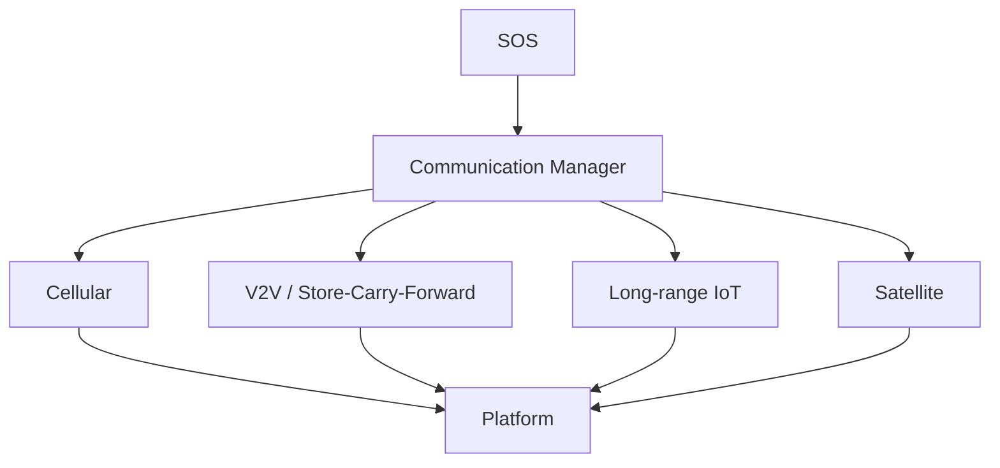

## Intelligence

```text
Prototype
  ↓
Two-stage classifier
  ↓
Validated continual learning
  ↓
Context-aware policy
  ↓
Safety-constrained RL optimization
```

RL is therefore a **policy optimization direction**, not a replacement for the accident classifier.

## Responder Integration & ERSS-112 National Alignment

For real-world deployment in India, attempting to build a private, parallel nationwide emergency dispatch network (tracking every police vehicle and ambulance) is unrealistic and redundant.

Instead, our platform is architected as an **upstream intelligent incident-generation layer** designed to integrate directly with India's official **Emergency Response Support System (ERSS-112)** under the Ministry of Home Affairs (MHA).

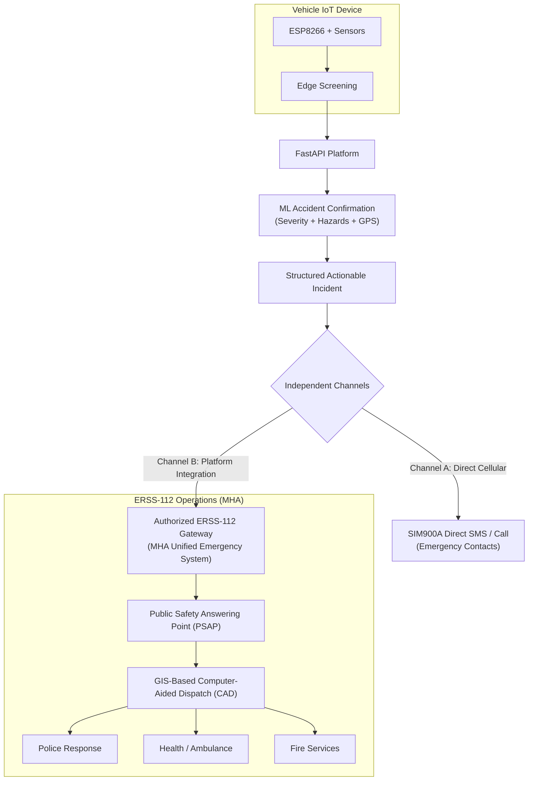

### 1. The Role of ERSS-112 in IoT Emergency Response
The Ministry of Home Affairs (MHA) designed ERSS-112 as India's unified emergency response system capable of accepting distress signals across multiple channels—**explicitly including IoT-based signals and automated machine-to-machine inputs**. ERSS-112 handles call taking, GIS-based incident mapping, and computer-aided dispatch (CAD) of the nearest physical emergency response units.

### 2. Our Core Value Proposition: Intelligent Noise Reduction
ERSS-112 is built to receive emergency signals, but raw sensor spikes would flood the emergency response lines with false alarms. 

Our system acts as the **intelligent filtration and enrichment layer**:
```text
Raw Sensor Stream (MPU6050)
         ↓
Edge Screening (ESP8266)
         ↓
Temporal Feature Extraction (Jerk, Impact G, Rotation, Speed Delta)
         ↓
Backend ML Confirmation (Noise rejection / Pothole filter)
         ↓
Hazard & Severity Classification (Severe, Medical, Police, Fire)
         ↓
Verified, High-Confidence Incident Record
         ↓
Forwarded to ERSS-112 PSAP / Dispatch
```

Instead of sending unverified raw signals, our platform generates a **rich, verified, machine-generated incident packet** containing exact GPS coordinates, impact severity, post-impact stillness metrics, and indicated emergency service requirements (Police / Medical / Fire).

### 3. Redundant Dual-Path Resilience
The system separates local direct alerts from platform-level emergency routing:
- **Direct Emergency Path (SIM900A):** Directly dials and texts family/emergency contacts over GSM UART, functioning even if the internet or backend is down.
- **Platform Emergency Path (ERSS-112):** Uploads full incident telemetry for dispatch coordination through authorized ERSS-112 interfaces.

### 4. Prototype vs. Production Architecture

| Dimension | Hackathon Prototype | Real-World Production Target |
|---|---|---|
| **Dispatch Target** | Internal In-Memory / SQLite Responder Registry | Authorized ERSS-112 (MHA) PSAP Interface |
| **Resource Routing** | Haversine distance computation across mock assets | ERSS-112 GIS Computer-Aided Dispatch (CAD) |
| **Operator Console** | Responder Operations Web Dashboard | Upstream Telemetry / Complementary PSAP Console |
| **System Boundary** | End-to-end simulated dispatch | Upstream Intelligent Incident Generation & Telemetry |

> **Jury Positioning Note:**  
> We do not claim to operate a private government dispatch fleet. Our platform solves the difficult upstream engineering problem: **accurately detecting, validating, and structuring vehicle accident telemetry at the edge and cloud before feeding clean, high-confidence incident records into national emergency infrastructure like ERSS-112.**

---

# 34. Final Engineering Position

The system is best understood as an **edge-first, two-stage accident intelligence and emergency-response platform**.

The final control philosophy is:

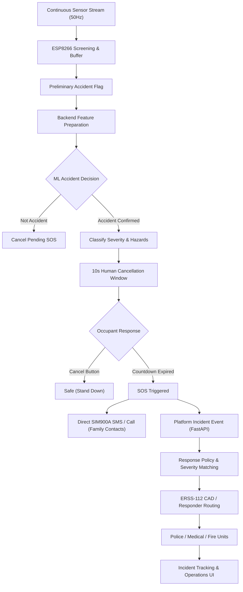

### The architectural insight

The project does not attempt to solve everything with one model, one server or one network.

It separates:

```text
DETECTION
CLASSIFICATION
ADAPTATION
SOS CONTROL
COMMUNICATION
INCIDENT MANAGEMENT
RESPONDER ROUTING
OPERATIONS
```

That separation is what makes the system resilient and extensible.

### The final product statement

> **Detect accidents locally. Confirm them intelligently. Give the occupant a chance to override. Escalate safely when the network is imperfect. Communicate through the available path. Convert the event into a location-aware incident. Route it toward the appropriate response capability. Track what happened next.**

---

### 👥 Team Details
- **Team ID:** INX-`039`  
- **Team Name:** π(Pi)  
- **Team Leader:** Chandan Usman Gani
- **Members:**
  - P Venkata Rahul Naidu
  - T Yugesh
  - DHANUNJAI REDDY KRISTIPATI

