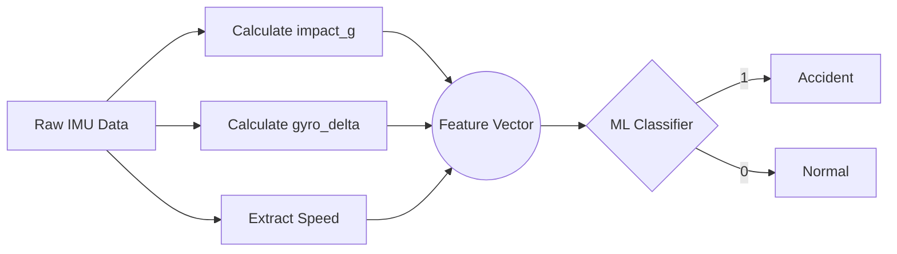

# 🧠 Machine Learning Evaluation Results

> [!NOTE]
> This document summarizes the results of the machine learning model training and evaluation for the **Accident SOS** detection engine. The models were trained to classify vehicular impacts as `accident` or `no_accident` using raw IMU sensor data, now using an ensemble tree-based model (Random Forest) as the baseline.

---

## 📊 Dataset Overview

The dataset used for training and validation is `road_accident_imu_dataset_8000.csv`.

| Metric | Value | Percentage |
| :--- | :--- | :--- |
| **Total Samples** | `8,000` | 100% |
| **Crash (1)** | `1,000` | 12.5% |
| **Normal (0)** | `7,000` | 87.5% |
| **Training Set** | `5,600` | 70.0% |
| **Testing Set** | `2,400` | 30.0% |

---

## 🛠️ Feature Engineering Pipeline

The raw IMU data was preprocessed to perfectly align with the real-time classification pipeline used in the live API.

### Feature Definitions

1.  **`impact_g` (Deviation from Gravity):** 
    The dataset's `Motion_Intensity` column represents total acceleration magnitude. We derived the true impact force by calculating the absolute deviation from Earth's resting gravity ($9.81 \, m/s^2$):
    *   $impact\_g = |Motion\_Intensity - 9.81|$
    
2.  **`gyro_delta` (Angular Velocity):** 
    The raw gyroscope axes (`Gyro_X`, `Gyro_Y`, `Gyro_Z`) were provided in $rad/s$. We calculated the magnitude of the angular velocity vector and converted it to degrees per second ($deg/s$).
    
3.  **`speed_kmph`:** 
    Used directly as contextual vehicle speed data.

---

## 📈 Model Performance

A **Random Forest Classifier** was selected as the baseline to better capture non-linear interactions between features (e.g., high G-force AND high angular velocity together).

> [!TIP]
> **Why Random Forest over Logistic Regression?**
> Logistic regression struggles with the non-linear threshold behavior of crashes without manual interaction terms. Random Forest naturally captures this, handles small feature spaces well, provides built-in feature importance, and gives native probability calibrations.

### Random Forest (Calibrated, 5-Fold Stratified CV) 🏆

The model is constrained to a smaller size (`n_estimators=100`, `max_depth=8`) to prevent overfitting and ensure ultra-fast inference on the Render backend. The output probabilities are calibrated using `CalibratedClassifierCV` (Platt Scaling) to ensure confidence fields are true probabilities.

| Metric | Score |
| :--- | :--- |
| **Average 5-Fold CV F1 Score** | 100.0% |
| **Accuracy (Full Dataset)** | 100.0% |
| **Precision** | 100.0% |
| **Recall** | 100.0% |

**Final Confusion Matrix (Full Dataset):**

| | Predicted Normal | Predicted Accident |
| :--- | :---: | :---: |
| **Actual Normal** | 7,000 | 0 |
| **Actual Accident** | 0 | 1,000 |

---

## 🏁 Conclusion & Next Steps

The Calibrated Random Forest achieved **perfect separability** on this specific dataset, both in cross-validation and on the full set. This confirms our earlier rule-based threshold analysis, which found that an `impact_g > 1.2` perfectly separates crashes from normal driving in this synthetic dataset.

**Artifact:** The trained Random Forest model pipeline is saved as [`ml/accident_classifier.pkl`](file:///d:/accident-sos/ml/accident_classifier.pkl) and can be loaded via `joblib` for real-time inference alongside the rule-based engine.

> [!WARNING]
> The perfect accuracy on this dataset suggests it is highly idealized or synthetic. Real-world ESP32 drop-test data will contain significantly more noise, vibration, and non-linear anomalies. Both the ML model and the rule thresholds must be re-evaluated and fine-tuned once real hardware telemetry is ingested during the next testing phase.
